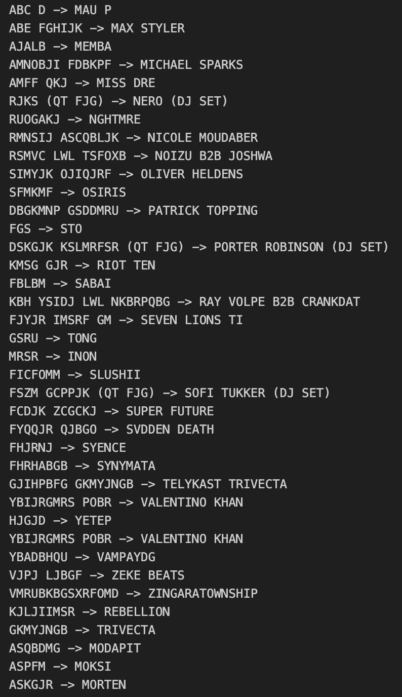

# Notebooks

This directory contains Jupyter notebooks I created during the process of implementing the lineup decryption process. As a result, the functionality of these notebooks is not intended to be used a standalone tool, but rather as a documentation of my thought process and the steps I took to decrypt the lineup data. The final decryption logic can be found in the [`../scripts`](../scripts/) directory. The notebooks are organized in the following way:

- `01_data-prep.ipynb`: This notebook contains the data preprocessing steps I took to prepare the data for decryption, including separating artists by lines and converting the data to an organized csv file.

- `02_decryption.ipynb`: This notebook contains the decryption process I used to decrypt the lineup data. The decryption process is based on the assumption that the lineup  is encrypted with a simple substitution cipher. Further information on the algorithm can be found [here](../README.md#algorithm)

The data used in the notebooks is the encoded lineup from Countdown NYE 2023, which was posted as a teaser on Instagram. The assumption was made that the lineup was encrypted with a simple substitution cipher. As each character in the teaser was an obscure symbol, I manually mapped them to alphanumeric characters prior to preparing the data.

