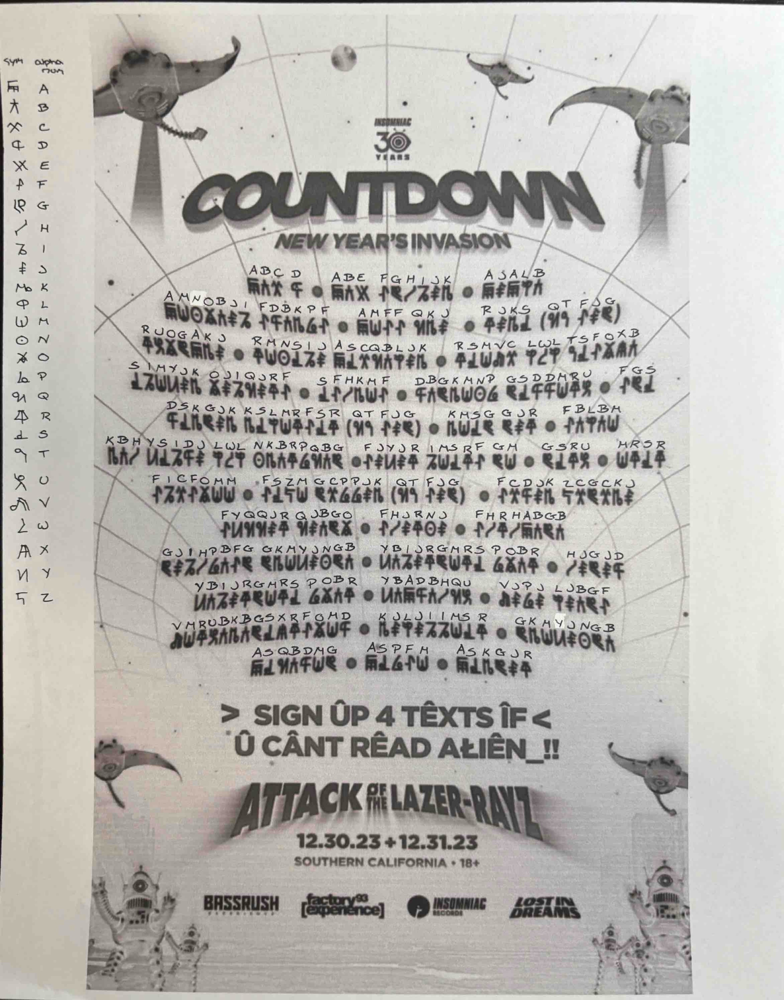
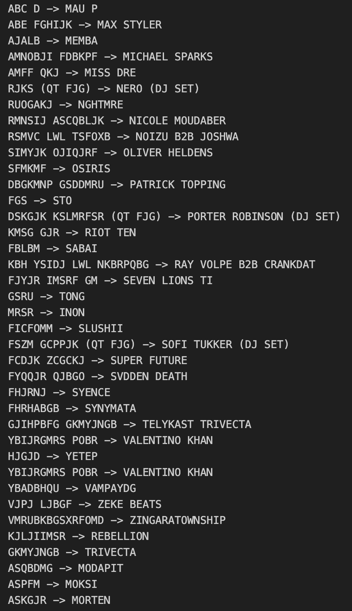
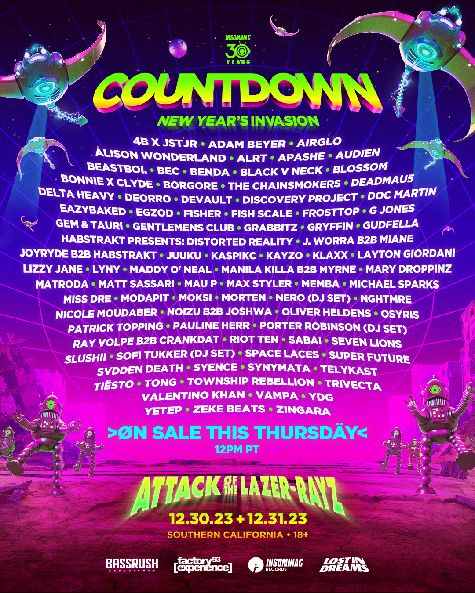

# Countdown 2023

This notebook is the initial decryption process I used to decrypt the Countdown NYE 2023 lineup. The most recent of the process can be found in at [`../02_decryption.ipynb`](../02_decryption.ipynb)(notebook) or [`../../scripts/decryption.py`](../../scripts/decryption.py)(script).

The data used in the notebooks for development is the encoded lineup from Countdown NYE 2023, which was posted as a teaser on Instagram. The assumption was made that the lineup was encrypted with a simple substitution cipher. As each character in the teaser was an obscure symbol, I manually mapped them to alphanumeric characters prior to preparing the data.

